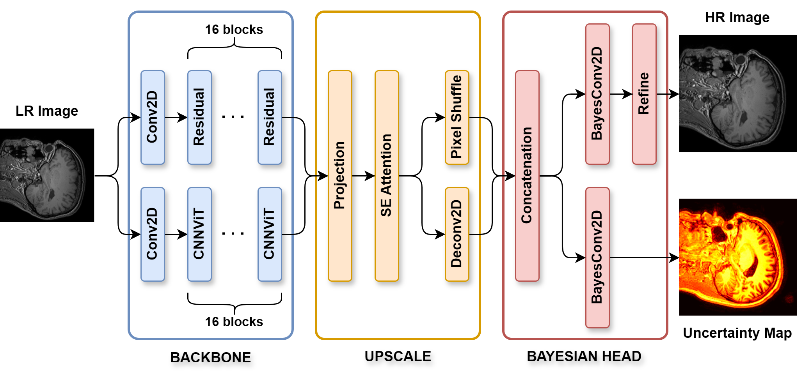
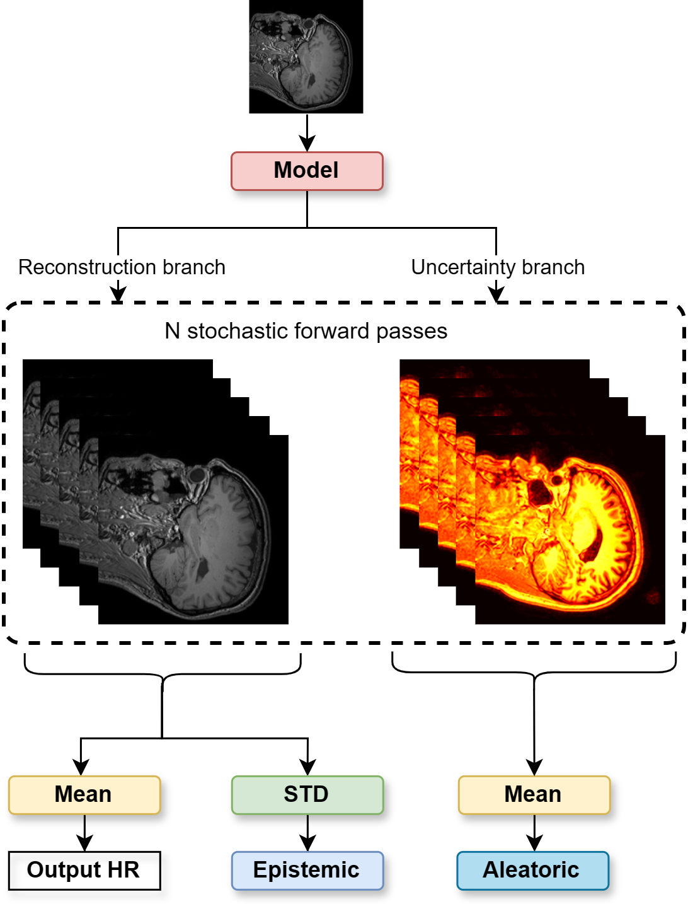
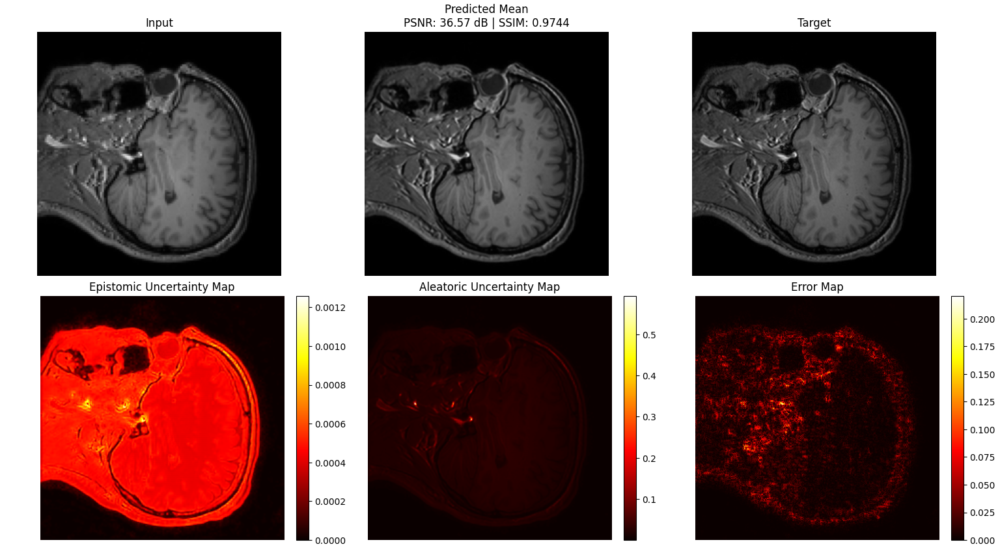

# Bayesian Inference Super Resolution

Implementation code for the research paper:

## **Enhancing Clinical Reliability of Medical Image Super-Resolution via Bayesian Deep Learning with Predictive Uncertainty Quantification Framework**

**Authors:**
Viet Ngo Quoc, Yen Thai
---

## Overview

Medical image super-resolution (SR) reconstructs high-resolution (HR) images from low-resolution (LR) acquisitions. While deep learning methods have achieved impressive reconstruction quality, most existing approaches provide deterministic predictions without reliability assessment.

This repository provides:

* Bayesian Super-Resolution framework
* Predictive uncertainty quantification
* Training, evaluation, and inference pipelines
* Medical imaging experiments using MRI datasets

---

## Key Features

* ✅ Bayesian deep learning-based Super-Resolution
* ✅ Pixel-wise uncertainty estimation
* ✅ Aleatoric + Epistemic uncertainty modeling
* ✅ Support for medical images (`.nii` / NIfTI format)
* ✅ Reproducible research pipeline

---

## Model Architecture

The proposed model consists of three main components: (i) a backbone network for feature extraction, (ii) an upscaling module for spatial resolution enhancement, and (iii) a Bayesian head that generates the super-resolved image along with  associated predictive uncertainty. 



---

## Uncertainty Estimation

By performing multiple inferences on the same input, this architecture enables the estimation of both
aleatoric and epistemic uncertainty.



---

## Project Structure

```
Bayesian_Inference_Super_Resolution/
│
├── data/           # Dataset loading and preprocessing
├── model/          # Network architectures
├── train/          # Training scripts
├── eval/           # Evaluation & testing scripts
├── utils/          # Helper functions and utilities
├── weights/        # Saved model checkpoints
├── logs/           # Training logs
└── README.md
```

---

## Dataset Structure

The dataset must follow the hierarchical organization:

```
{DATA_FOLDER_PATH_FULL}/
    └── {StudyID}/
        └── {Scan Type}/
            └── {File Name}.nii
```

### Example

```
dataset/
├── Study_001/
│   ├── T1/
│   │   ├── image_01.nii
│   │   └── image_02.nii
│   ├── T2/
│   │   └── image_01.nii
│
├── Study_002/
│   └── FLAIR/
│       └── scan_01.nii
```

| Component     | Description                            |
|---------------| -------------------------------------- |
| **StudyID**   | Patient or acquisition session         |
| **Scan Type** | Imaging modality (T1, T2, FLAIR, etc.) |
| **File Name** | 3D medical image in NIfTI format       |

---

## Installation

### Clone repository

```bash
git clone https://github.com/Sherlockian1212/Bayesian_Inference_Super_Resolution.git
cd Bayesian_Inference_Super_Resolution
```

### Create environment

```bash
conda create -n bayesian_sr python=3.12
conda activate bayesian_sr
```

### Install dependencies

```bash
pip install -r requirements.txt
```

---

## Training

```bash
python train/training_model.py
```

Outputs:

* Training logs → `logs/`
* Model checkpoints → `weights/`

---

## Evaluation

```bash
python eval/evaluation_model.py
```

Evaluation includes:

* Reconstruction metrics
* Visual comparison
* Predictive uncertainty analysis

---

## Output

The framework generates:

* Super-resolved images
* Predictive mean reconstruction
* Pixel-wise uncertainty maps



---

## 👨‍💻 Authors

* Viet Ngo Quoc
* Yen Thai

---

## 📜 License

MIT License
